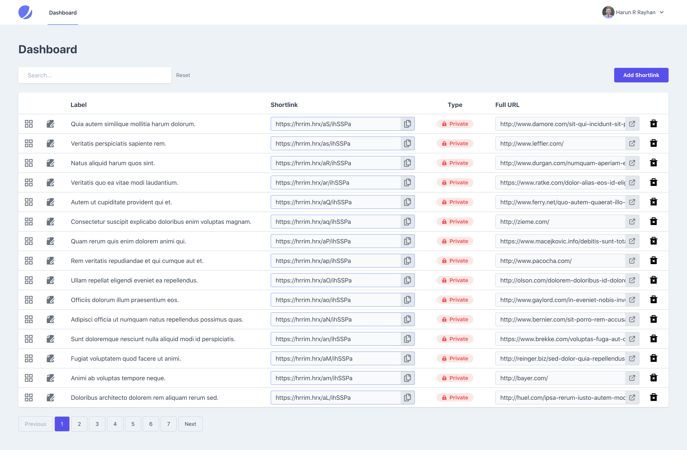
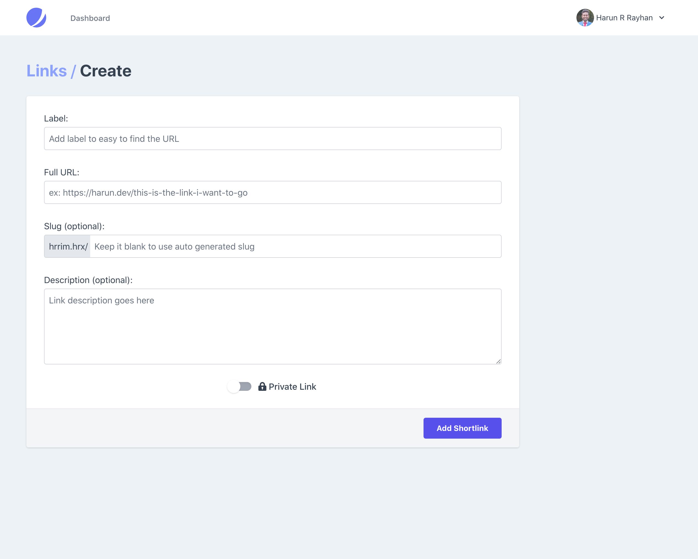
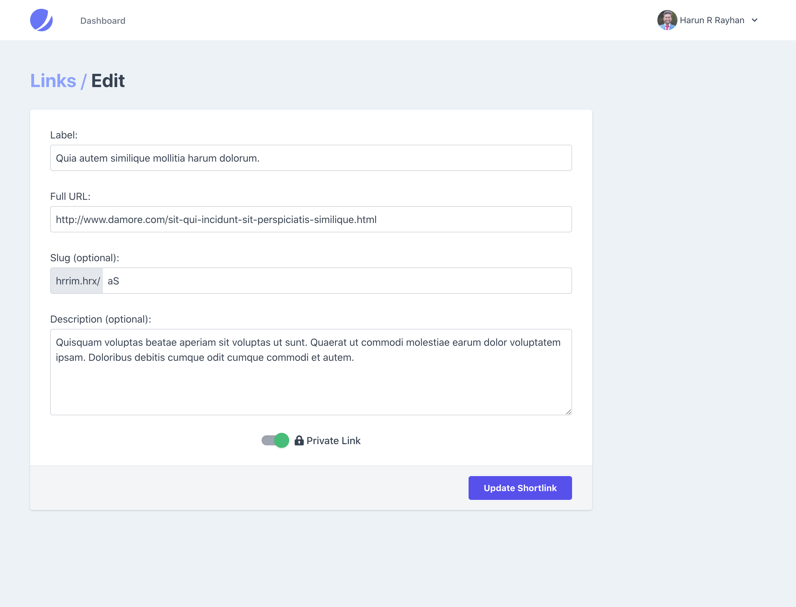

# HRR.im - Personalized Shortlink Generator
[](http://choosealicense.com/licenses/mit/)

It's simple yet powerful shortlink generator using the Laravel Framework. It's saves statistics of each link clicks too. See [SCREENSHOTS](#screenshots) for UI design
## Installation
Clone this app into your directory using git:
```bash
$ git clone https://github.com/HarunRRayhan/hrr.im.git your-directory
```

Now, go to your directory:
```bash
$ cd your-directory
```

See [Usage](#usage) to more...

## Usage
Install all composer dependencies:
```bash
$ composer install
```

Copy `.env.example` as `.env` and generate new app key using this
```bash
php artisan key:generate
```

Then, migrate your the database by this command:
```bash
$ php artisan migrate
```
Or you can migrate with default data:
```bash
$ php artisan migrate --seed
```
Now use `me@hrr.im` in email and `password` in password to login.

## Development
Do you want to develop your app from this? Install all NPM packages first:
```bash
$ npm install
```
And then run development command:
```bash
$ npm run dev
```

## Screenshots
Dashboard:


Add Shortlink:


Edit Shortlink:


## Contributing
Pull requests are welcome. For major changes, please open an issue first to discuss what you would like to change.

Please make sure to update tests as appropriate.

## Contributors
- [Harun R Rayhan](https://github.com/HarunRRayhan)
- All Other Contributors

## License
[MIT](./LICENSE.md)
